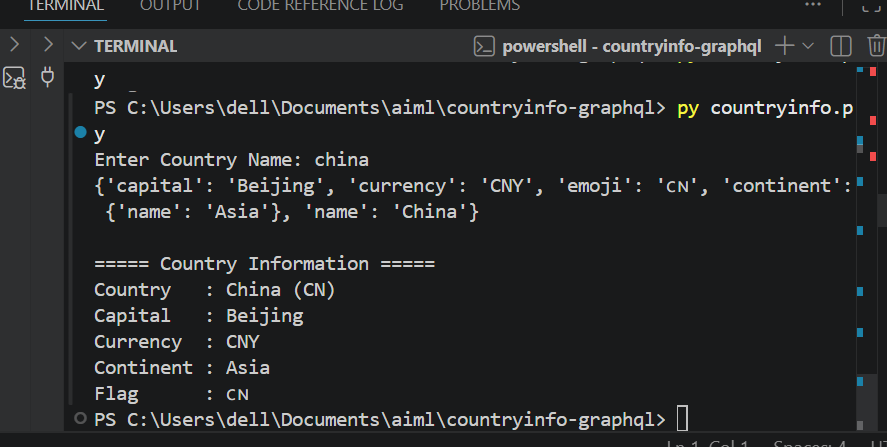

# Country Explorer (GraphQL)

A Python application that fetches country information using GraphQL.

## Features

- Search countries by name
- Display country code
- Display capital
- Display currency
- Display continent
- Display country flag

## Output

